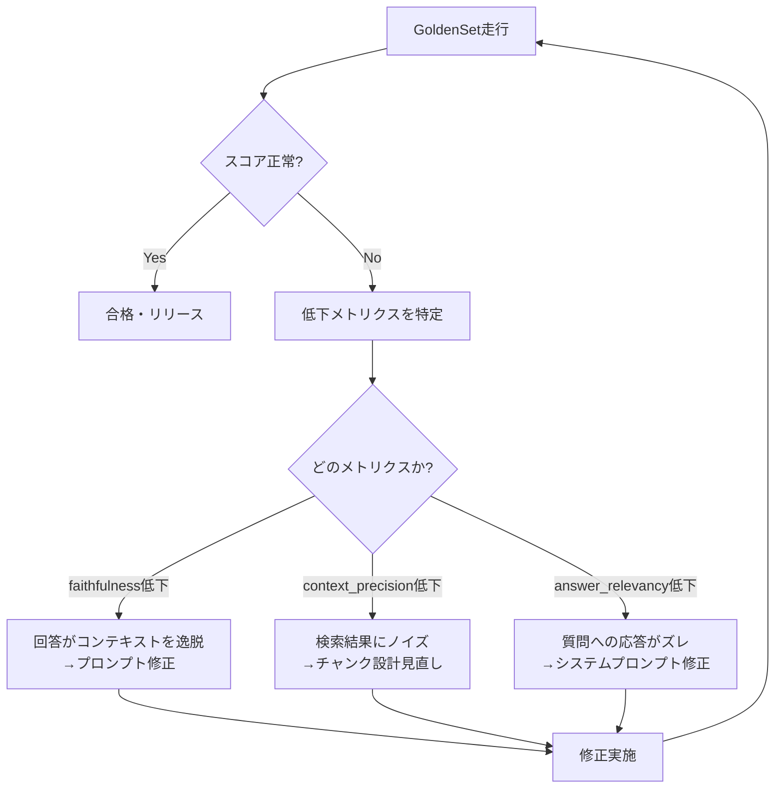

## はじめに

LLM を使ったナレッジベースを運用していると、「良くなった気がする」という瞬間がある。

検索対象のノートを整理した。プロンプトを直した。参照すべきファイルも減らした。実際に何問か試すと、前より自然に答えているように見える。では、それをリリースしてよいのか。あるいは、別モデルへ切り替えてよいのか。

この問いに、体感だけで答えるのはかなり危うい。

私が運用しているナレッジベースでも、最初は「Claude Opus の方が良さそう」「前の設計より安定した気がする」という感覚で判断していた。しかし、感覚は再現できない。昨日の自分が読んだ質問セットと、今日の自分が読んだ質問セットは違う。たまたま得意な質問だけを見ているかもしれないし、逆に失敗例だけが印象に残っているかもしれない。

そこで Golden Set を 35 問作り、各問を 3 メトリクス、各 0/1/2 点で採点する評価基盤を作った。結果として、評価基盤は単なる点数表ではなく、ナレッジベースの設計ミス、記録ミス、モデル差分を照らすライトになった。

この記事では、RAGAS の考え方を下敷きにしながら、Golden Set と 3 メトリクスで「根本原因まで辿れる評価軸」を作った実践をまとめる。

## ナレッジベース評価がなぜ難しいか

ナレッジベース評価の難しさは、回答品質がひとつの値に収まらないところにある。

回答が正しそうに見えても、参照したノートが違うことがある。参照は合っていても、質問に直接答えていないことがある。逆に、回答文だけ読むと自然でも、コンテキストにない情報を補っていることもある。

つまり「良い回答だった」という体感の中には、検索、根拠、応答意図の複数要素が混ざっている。

### 「なんとなく良くなった」の危険性

体感評価には少なくとも 3 つの問題がある。

1 つ目は認知バイアスだ。直近で修正した箇所に関係する質問だけを試し、「そこが改善したから全体も良くなった」と見なしやすい。

2 つ目は再現性の欠如だ。同じ変更を別の日に評価しても、どの質問を投げたか、どの回答を重く見たかが揃わない。これでは v0.5 と v0.6 の差を比較できない。

3 つ目は原因分解できないことだ。スコアがないと、失敗したときに「検索が悪い」のか「回答生成が悪い」のか「評価データが汚れている」のかを切り分けにくい。

### 評価に必要な3つの要素：何を・どこで・どう測るか

評価を運用に載せるには、最低限、次の 3 つを分けて定義する必要がある。

| 要素 | 意味 | 例 |
|---|---|---|
| 何を測るか | 評価対象の振る舞い | 回答の忠実性、参照ノートの妥当性、質問への適合 |
| どこで測るか | 固定された入力集合 | Golden Set の 35 問 |
| どう測るか | 採点ルール | 各軸 0/1/2 点、合計点と失敗箇所を記録 |

この 3 つが揃うと、評価は「雰囲気の確認」から「差分を説明する道具」に変わる。

## RAGASとは何か――LLMを使ってLLMを評価する

RAGAS は Retrieval Augmented Generation Assessment の略で、RAG パイプラインを評価するためのフレームワークとして 2023 年 9 月に論文が投稿された。特徴は、検索と生成を別々の観点から見て、ground truth の人手アノテーションが常に揃っていなくても評価サイクルを回せるように設計されている点にある。

ここで重要なのは、RAGAS を「便利な採点ライブラリ」とだけ見ることではない。むしろ設計思想が重要だ。RAG の失敗は、検索器が悪い場合もあれば、LLM が取得コンテキストを使い損ねる場合もある。だから、回答だけを読んで丸ごと良し悪しを決めるのではなく、検索されたコンテキスト、回答、質問意図を別々に見る。

### Ground truthなしで評価できる理由

RAGAS の発想は LLM-as-Judge に近い。人間がすべての正解文を用意する代わりに、評価用 LLM に「この回答は取得コンテキストに支えられているか」「このコンテキストは質問に関係しているか」を判定させる。

もちろん、これは完全な客観性を意味しない。評価用 LLM の揺れは残るし、評価プロンプトの設計も必要になる。それでも、人間が毎回目視で判断するより、同じ質問セットに同じ基準を当て続けられる。運用上ほしいのは、絶対真理ではなく、変更前後を比較できる安定したものさしである。

### 4つのメトリクスが測るもの

RAGAS の代表的な RAG 評価軸は、次のように整理できる。

| メトリクス | 見ているもの | 失敗時に疑う箇所 |
|---|---|---|
| faithfulness | 回答が取得コンテキストに支えられているか | 生成側のハルシネーション、過剰補完 |
| context_precision | 関連コンテキストが上位に来ているか | 検索、チャンク設計、クエリ変換 |
| context_recall | 必要な情報を取得できているか | 検索漏れ、インデックス不足 |
| answer_relevancy | 回答が質問意図に合っているか | プロンプト、回答方針、不要情報 |

私の評価基盤では、この思想をそのまま使いつつ、運用しやすい 3 軸に絞った。`faithfulness`、`context_precision`、`answer_relevance` である。context recall は、Expected Source を明示する設計で一部を代替した。

RAGAS は評価関数を提供するが、何を正解とするかは定義しない。Golden Set はその正解定義を担う。この二者が揃って初めて根本原因探索が可能になる。

## Golden Set設計――評価の「ものさし」を作る

Golden Set は、システムの重要な振る舞いを固定した評価用質問セットである。私のケースでは 35 問を用意した。構成は 5 カテゴリ × 6〜8 問で、頻出クエリとエッジケースを混ぜている。

たとえば、よく聞かれる運用ルールだけでなく、複数ノートをまたぐ質問、古い記述と新しい記述が衝突しやすい質問、モデルが余計な推論をしやすい質問も入れた。

### GoldenSetとは何か

Golden Set の目的は、平均点を高く見せることではない。変更のたびに同じ質問を走らせ、どこが崩れたかを比較できるようにすることだ。

各問には、質問文、期待する回答の要点、Expected Source、採点メモを持たせた。採点は次の 3 軸で行う。

| 軸 | 問い | 採点 |
|---|---|---|
| faithfulness | 回答はコンテキストに忠実か | 0/1/2 |
| context_precision | 引いてくる参照ノートは過不足ないか | 0/1/2 |
| answer_relevance | 質問に直接的に答えているか | 0/1/2 |

1 問あたり最大 6 点。35 問なら最大 210 点になる。

### Expected Source設計の原則と落とし穴

Expected Source は、質問に答えるために参照されるべきノートである。ここで重要なのは、Expected Source とソース本文を 1 対 1 で対応させることだ。

「この質問なら、たぶんこの情報も答えてほしい」と人間が思っても、ソースに書かれていなければ Expected に入れない。入れた瞬間、評価データが人間の思い込みで汚染される。

これは実際に起きた。Memory 引越し時の質問 B-01 で、ソースにない情報を Expected に盛り込んでいた。つまり、システムではなく評価データ側が壊れていた。

### 合格ラインの決め方（なぜ80%か）

合格ラインは 80% に置いた。根拠は、運用上の誤検知許容度と試行錯誤の結果である。

100% だけを合格にすると、評価用 LLM の揺れや軽微な表現差でリリース判断が止まりやすい。一方で 70% 台を許すと、明らかな検索ミスや不要参照を見逃しやすい。80% は、実運用で「失敗を見つける感度」と「改善サイクルを止めない現実性」のバランスが取れたラインだった。

## 実際に何が見つかったか――3つの発見

評価基盤を作って一番大きかったのは、点数そのものではなく、点数が異常を指し示したことだった。

### 発見1（リード）: Expected Source不整合を検出して根本原因まで辿った

B-01 問を走らせたとき、スコアが 4/6 に落ちた。

最初は、検索が悪いのだと思った。だがログを見ると、参照ノート自体は大きく外れていない。次に回答を見ると、回答もそれなりに妥当だった。ではなぜ落ちたのか。

Expected を見直すと、Memory 引越し時に、ソース本文には存在しない情報を期待値側に入れていたことが分かった。つまり、評価基盤が検出したのは「システムの回答ミス」ではなく「評価データの汚染」だった。

対応は単純だった。Golden Set を走行し、スコア低下を確認する。Expected を見直す。必要な情報をソースへ追記する。再走行する。結果、B-01 は 6/6 に回復した。

体感評価では、この種のミスはかなり見落としやすい。人間は「そういえば、その情報もあるはず」と記憶で補ってしまう。メトリクスはその補完を許さない。どの問いで、どの軸が、何点落ちたかを示すからだ。

### 発見2: 評価基盤が自分のドキュメントの算術ミスを検出した

別のケースでは、v0.5 の評価サマリーに 163/180 と記録されていた。しかし、Golden Set を再走行して個別スコアを確認すると、実際の合計は 176/180 だった。13 点ずれていた。

これはモデルの品質差ではない。評価サマリー側の算術ミスである。

この発見は地味だが、かなり重要だった。評価基盤は、外部システムを測るためだけの道具ではない。自分たちの記録、認識、サマリーのバグも検出する鏡になる。

「前回より悪い」「今回は良い」と言っている数字そのものが間違っていたら、改善判断は崩れる。評価をコードや表で再走行できる形にしておくと、その前提を検査できる。

### 発見3: 「Opusの方が良い気がする」を35問中1問の差として定量化

モデル比較でも、評価基盤は効いた。

体感では Claude Opus 4.7 の方が Claude Sonnet 4.6 より良さそうに見えた。だが、実際に 35 問で比較すると、差は非常に小さかった。

| モデル | 合計スコア |
|---|---:|
| Claude Opus 4.7 | 210/210 |
| Claude Sonnet 4.6 | 209/210 |

差が出たのは E-06 問だった。Sonnet は `INDEX.md` と `CommandProtocol.md` の両方を参照し、`context_precision` で 1 点落とした。Opus は `INDEX.md` L50 のみを参照し、「過不足なし」と判定され、満点だった。

つまり「Opus の方が良い気がする」は、35 問中 1 問、1 メトリクスの差として説明できた。これは単に Opus を褒める話ではない。モデル差分を、予算やレイテンシと比較可能な単位まで落とせたことが重要だった。

## メトリクス低下から根本原因へ――RCAの接続

評価スコアは、単独では判断材料にすぎない。重要なのは、スコア低下を RCA、つまり Root Cause Analysis に接続することだ。

私の運用では、低下したメトリクスごとに最初に疑う箇所を決めた。

| 低下した軸 | 最初に疑うもの | 典型的な対応 |
|---|---|---|
| faithfulness | 回答がコンテキスト外へ出ている | システムプロンプト、回答制約、引用方針を見直す |
| context_precision | 余計なノートを引いている | チャンク設計、検索クエリ、インデックスを見直す |
| answer_relevance | 質問に直接答えていない | 応答フォーマット、タスク解釈、優先順位を見直す |

この表があるだけで、失敗時の会話が変わる。「なんか変」ではなく、「context_precision が落ちたので検索側から見る」と始められる。

### スコアの読み方：どのメトリクスが何を示唆するか

faithfulness が落ちる場合、回答文の中にコンテキストから支えられない主張が混ざっている可能性が高い。プロンプトに「推測で補うな」と書いていても、モデルは自然な回答を作るために補完することがある。

context_precision が落ちる場合、検索結果にノイズが混ざっている。ノイズが後段の回答に使われていなくても、運用上は危険信号である。将来の質問では、そのノイズが回答に入り込むかもしれない。

answer_relevance が落ちる場合、回答は正しいが質問に対して遠回りしていることが多い。FAQ なら冗長な背景説明、運用コマンドなら余計な前提説明が混ざる。

### RCAサイクル図（Mermaid）

このサイクルを回すと、評価はゲートではなくデバッグループになる。合格か不合格かで止めるのではなく、どこを見ればよいかを次の作業に変換する。

## バージョン間比較で改善を可視化する

最終的なバージョン比較は次のようになった。

| バージョン | モデル | スコア | 判定 |
|---|---|---:|---|
| v0.5 | Claude Sonnet 4.6 | 163/180（90.6%） | PASS |
| v0.6b | Claude Sonnet 4.6 | 209/210（99.5%） | PASS |
| v0.7 | Claude Opus 4.7 | 210/210（100.0%） | PERFECT PASS |

v0.5 から v0.6b では、複数の設計見直しにより大幅に改善した。詳細な内訳はここでは固定できないが、重要なのは「改善した気がする」ではなく、同じ評価軸で大幅改善を確認できたことだ。

また、v0.6b から v0.7 では 209/210 から 210/210 への改善に留まった。これは、Opus が常に圧倒的に良いという話ではない。むしろ、現行の Golden Set 上では差分が限定的だと分かった。

この情報は運用判断に使える。たとえば、最高精度が必要な処理では Opus を使う。日常的な問い合わせでは Sonnet のコスト効率を優先する。そうした判断を、印象ではなく、どの質問で何点差が出たかに基づいて議論できる。

## 次のステップ――手動評価から自動パイプラインへ

今回の評価は、RAGAS の思想を取り入れつつ、実運用に合わせた手動・半自動の Golden Set 評価として作った。次の段階は、これを自動パイプラインに載せることだ。

方向性は 3 つある。

1 つ目は、Golden Set の実行を CI 的に回すこと。ナレッジベースやプロンプトを変更したら、35 問を自動実行し、前回との差分を出す。

2 つ目は、RAGAS や DeepEval のような評価フレームワークと接続すること。手元の 0/1/2 点採点を維持しながら、faithfulness や context_precision の評価をより標準化できる。

3 つ目は、失敗例の蓄積である。スコアが落ちた質問を単に修正して終わらせず、「なぜ落ちたか」「どのメトリクスが先に反応したか」を記録する。これが次の Golden Set 改訂の材料になる。

評価基盤は一度作って終わりではない。ナレッジベースが変われば、重要な質問も変わる。だからこそ、Golden Set は固定されたテストでありながら、運用知見を反映して育てる対象でもある。

## まとめ：評価軸を持つとは「自分たちを照らすライトを持つ」こと

ナレッジベース運用で怖いのは、改善したつもりになることだ。

プロンプトを直した。ノートを整理した。モデルを変えた。どれも必要な作業だが、それだけでは改善したかどうかは分からない。必要なのは、同じ質問に、同じ基準を、繰り返し当てられる評価軸である。

Golden Set は「何を正解とするか」を定義する。メトリクスは「どこが崩れたか」を示す。RCA サイクルは「次に何を見るか」へつなげる。

今回の実践では、Expected Source の不整合、評価サマリーの算術ミス、Opus と Sonnet の 1 点差まで見えた。どれも体感だけでは曖昧になりやすい。

評価軸を持つとは、点数で安心することではない。自分たちのシステム、自分たちのドキュメント、自分たちの思い込みを照らすライトを持つことだ。

## 参考

- Ragas: Automated Evaluation of Retrieval Augmented Generation: https://arxiv.org/abs/2309.15217
- RAGAS GitHub repository: https://github.com/explodinggradients/ragas
- RAGAS documentation: https://docs.ragas.io/en/stable/getstarted/
- DeepEval RAGAS metrics: https://deepeval.com/docs/metrics-ragas
