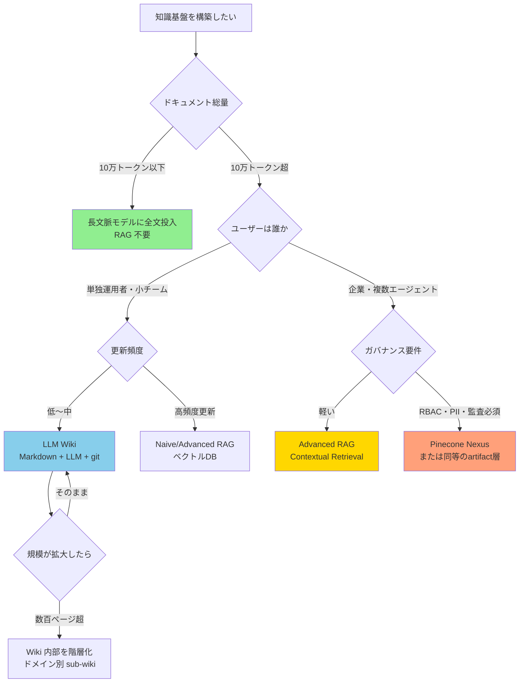

対象読者: Obsidian 等で情報管理をしていて、LLM に賢く検索させたいエンジニア・個人開発者
前提知識: Markdown の読み書き、LLM の基本的な使い方（RAG という言葉を聞いたことがある程度で OK）
確認バージョン: 概念記事のため特定バージョンなし / 確認日 2026-05-26
所要時間: 読了 10 分

---

## RAG を入れれば解決する、という罠

「まず RAG を入れよう」。知識ベースを整備しようとしたとき、最初にたどり着く答えがこれだ。

自分も同じルートをたどった。ベクトル DB を立て、チャンクを流し込み、クエリを投げる。精度が低ければチャンクサイズを変え、リランキングを追加した。それでも「思ったような回答が返ってこない」状態が続いた。構造を変えるたびにメンテナンスコストが積み上がり、半年後には誰も触らないシステムが残った。

問題は RAG の実装精度ではなかった。**自分のドキュメント量・更新頻度・運用体制に合わない手法を選んでいた**のが根因だった。

この記事では、Pinecone、Karpathy、nori_handa の 3 者の知見を横断し、「前提条件から手法を選ぶ」設計フレームワークを整理する。「どの手法が最強か」の答えは出さない。「自分の状況に合った手法はどれか」を判断する軸を渡す。

---

## 問題の本質：精度ではなく選択の順序

RAG の精度が上がらないとき、原因を「実装の問題」として探しはじめる。チャンクサイズ、埋め込みモデル、リランキングのアルゴリズム。これらは確かに精度に影響する。しかし、そこで詰まっている人の多くは、もっと手前の問題を抱えている。

症状は「精度が低い」「維持できない」だ。根因は「前提条件を確認せずに手法を選んでいる」こと。

具体的に言えば、「ドキュメントが何トークンあるか」「更新は週次か日次か」「使うのは自分 1 人かチームか」——これを測らずに実装に入っている。10 万トークン以下のドキュメントセットに RAG を入れるのはオーバーエンジニアリングだ。長文脈モデルに全文を渡せば済む。逆に、日次で数百件流入するドキュメントに LLM Wiki を使うと、ingest のたびに関連ページが連鎖更新され、API コストが爆発する。

手法の優劣の問題ではなく、選択の順序の問題だ。

---

## 解決策：前提条件から手法を選ぶフレームワーク

3 つの異なるアプローチが収束する一点が「Progressive Disclosure」という思想だ。

> **クエリ時に毎回生ドキュメントを解釈させるな。取り込み時に知識をコンパイルしておけ。**

LLM に渡す知識は、型・出典・構造を持つべきだ。一度に詰め込むのではなく、必要な情報を必要なタイミングで層状に取得する。Naive RAG から Pinecone Nexus まで、すべての手法がこの思想の実装形態として整理できる。

以下のフローチャートで、自分の状況を確認してから手法を選ぶ。

最初の分岐はドキュメント総量だ。10 万トークン以下なら RAG も Wiki も不要で、長文脈モデルへの全文投入が最速の答えになる。そこを超えた場合にはじめて、ユーザー数・更新頻度・ガバナンス要件の確認に進む。

---

## 4 手法の比較と設計思想

### 手法比較表

| 観点 | Naive RAG | Advanced RAG | LLM Wiki | Pinecone Nexus |
|---|---|---|---|---|
| 知識の加工タイミング | クエリ時 | クエリ時（高度な前処理） | ソース追加時（一度） | コンパイル時（一度） |
| LLM に渡すもの | 生のチャンク | 文脈付きチャンク＋リランキング | 構造化 Wiki ページ | タスク特化 artifact |
| 知識の蓄積 | なし | Agentic RAG ならメモリ層 | あり（ページ間リンク） | あり（artifact 再利用） |
| 同じ質問への再回答 | 毎回検索 | 毎回検索（精度高） | 既存ページから即答 | 既存 artifact から即答 |
| 必要インフラ | ベクトル DB | ベクトル DB＋リランカー | Markdown + LLM | Pinecone Nexus 専用 |
| 月額コスト目安 | 低〜中 | 中 | LLM API のみ | 中〜高（Builder $20〜） |
| 構築期間 | 数日 | 数週間 | 数日〜数週間 | 数日〜数ヶ月 |
| 運用負荷 | 低 | 中 | 中（lint 必須） | 低（マネージド） |
| ガバナンス | 個別実装 | 個別実装 | 個別実装 | 組込（RBAC・PII・監査） |
| 規模上限 | 〜1000 ドキュメント | 数万〜 | 〜数百ページ（無階層） | 企業規模 |

### なぜこの 4 分類か

この分類は「知識をいつ加工するか」という軸で整理している。Naive RAG と Advanced RAG はクエリ時に毎回解釈コストを払う。LLM Wiki と Pinecone Nexus はソース取り込み時に一度だけコンパイルし、クエリ時のコストを下げる。右に行くほどインフラ要件とガバナンス機能が増える。個人開発者が左から始めて規模に応じて右にずらす、というのが自然な成長経路になる。

なお、表中の「Pinecone Nexus」は Pinecone 社が提唱する知識インフラの設計アーキテクチャを指す概念的な呼称であり、単一製品の名称ではない。

### 4 つの設計原則

どの手法を選んでも共通して守るべき原則が 4 つある。

**原則① チャンクの自己完結性**

どのチャンク・どのページも、単独で意味が通じること。「前章で述べた」「上記の通り」といった文脈依存表現を残さない。何の・どのシステムの・いつ時点の情報かを明示する。固有名詞とバージョン情報を省略しない。ベクトル検索の精度問題の 7 割は、この原則の違反が原因だと判断している。

**原則② コンパイル時の構造化**

クエリ時の即興解釈ではなく、取り込み時に型・出典・構造を付与する。frontmatter の統一、出典 URL の保持、タグ・カテゴリの規律が必須になる。構造のないドキュメントを大量に入れても、LLM は毎回解釈コストを払い続ける。

**原則③ 評価基盤の先行**

30〜50 問のゴールデンセットを最初に用意する。[RAGAS](https://docs.ragas.io/) または [DeepEval](https://docs.confident-ai.com/) で faithfulness と context precision を測定する。「体感で精度が上がった気がする」は評価ではない。評価基盤なしの改善サイクルは、改善しているかどうかを確認できないまま作業を続けることになる。

**原則④ 段階的成長**

最初は単一の `index.md` か 1 つのテーブルから始める。規模拡大に応じて階層化・分割する。早すぎる最適化は維持コストだけを増やす。個人の Obsidian Vault を最初から企業向けアーキテクチャで構築する必要はない。

---

## 実務では組み合わせが普通：3 つのハイブリッド戦略

単一手法で設計を完結させる必要はない。前提条件が混在する場合は、手法を組み合わせるのが現実解だ。

**パターン A: Hot/Cold 分離**

頻繁に更新される情報は Advanced RAG、安定した知見は LLM Wiki に分ける構成。日々のミーティングメモは RAG で都度検索し、戦略文書や設計原則は Wiki にコンパイル済みで保持する。更新コストと検索精度のトレードオフを、情報の性質で分離する考え方。

**パターン B: 階層 Wiki + 検索**

要約層（数十ページ）を LLM Wiki でドメイン特定に使い、詳細層（数千ページ）をベクトル検索で取得する 2 段構成。クエリ時にまず Wiki でドメインを絞り、該当ドメインの詳細層だけを検索対象にすることで精度と速度を両立させる。

**パターン C: Compile-then-Search**

取り込み時に LLM でドキュメントを再構成し、構造化済みの状態でベクトル DB に保存する構成。Pinecone Nexus のアーキテクチャ（コンパイル → artifact 保存 → ハイブリッド検索）を個人スケールで模倣したもの。クエリ時の解釈コストを取り込み時に前払いする点が、Naive RAG との本質的な違い。

---

## よくあるアンチパターン 5 選

これだけ避ければ、設計の方向性は大きく外れない。

**「ドキュメントを全部入れれば精度が上がる」**

全部入れると古いドキュメント・重複・矛盾が検索結果を汚染する。精度を上げる本丸は追加ではなく削除だ。整理・廃棄のルールを決めてから入れる。

**「一度作れば終わり」**

知識ベースは必ず劣化する。lint の周期と責任者を最初に決める。メンテナンスの仕組みを組み込まない設計は、半年後に誰も触らないシステムを生む。

**「評価せず体感で判断する」**

チューニングを重ねて「精度が上がった気がする」という状態が最も危険だ。ゴールデンセットを先に用意し、baseline との差分で判断する。

**「流行りのアーキテクチャを追う」**

Contextual Retrieval や Agentic RAG は強力だが、自分のドキュメント量と更新頻度に合わなければ宝の持ち腐れになる。規模・専門性・更新頻度を先に確認してから手法を選ぶ。

**「長文脈で済むのに RAG を入れる」**

10 万トークン以下のドキュメントセットにベクトル DB を立てるのはオーバーエンジニアリングだ。まず長文脈モデルへの全文投入を試す。それで解決するなら RAG は不要だ。

---

## 実践者の正直な反省：自分の Vault はどこにいるか

自分の Vault（Knowledge Nexus）は Karpathy 型 LLM Wiki の運用実装だ。`index/Clippings/` でソースを受け取り、LLM で再構成して `index/03_Resources/` に保存する。`VaultIndex.md` が index.md に相当し、`@librarian` と `@analyst` がクエリ層を担う。Markdown と LLM API だけで動いており、ベクトル DB も Pinecone も使っていない。

この構成で「LLM に賢く検索させる」という目的は達成できている。個人の知識管理用途では LLM Wiki で十分だ、というのが実際に運用した結論だ。

ただし、原則③——**評価基盤の先行**——だけは後回しにした。ゴールデンセット（`QualityGoldenSet.md`）がない状態で改善を続けてきた。「精度が上がった気がする」という体感ベースの判断をしていた。nori_handa が認めた最大の課題と全く同じ問題を、自分も抱えている。

この反省は、Karpathy 型 Wiki を実装した全員に共通する課題だと判断している。手法が軽量であるほど、評価基盤の整備が後回しになりやすい。

---

## まとめ：まず自分の前提条件を測る

この記事でわかったことを 3 点にまとめる。

- 手法の優劣ではなく、自分の前提条件（ドキュメント量・更新頻度・ガバナンス要件）が手法を決める
- Progressive Disclosure の思想——取り込み時にコンパイルし、クエリ時のコストを下げる——はどの手法にも共通する
- 評価基盤（ゴールデンセット）の整備は後回しにしない

実装前に確認すべきチェックリストを残す。

- [ ] ドキュメント総量を測定した（トークン数）
- [ ] ユーザーは人間かエージェントか明確にした
- [ ] 更新頻度（hot / cold）を分類した
- [ ] ガバナンス要件（RBAC / PII / 監査）を確認した
- [ ] 30〜50 問のゴールデンセットを書いた
- [ ] 長文脈モデルで足りないか試した
- [ ] 段階的成長の最初のステップを定義した

最初のステップは「ドキュメント総量を測ること」だ。それだけで、RAG が必要かどうかの半分は決まる。

---

## 参考文献

**Andrej Karpathy**（OpenAI 共同創業者・元 Tesla AI Director）「llm-wiki.md」

https://gist.github.com/karpathy/442a6bf555914893e9891c11519de94f

**Pinecone**「Knowledge Infrastructure for Agents」

https://www.pinecone.io/blog/knowledge-infrastructure-for-agents/

**nori_handa**「社内の知見を AI が漏らさず拾う唯一の設計思想」

https://zenn.dev/nori_handa/articles/llm-knowledge-base-karpathy-wiki
