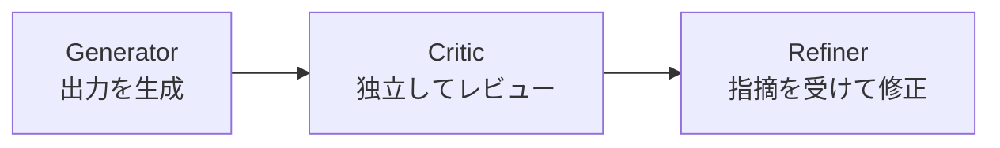

## サブエージェントを組んだのに、なぜかひどい出力が返ってくる

調査担当、分析担当、レビュー担当に分けてパイプラインを組んだ。
各エージェントには役割を明確に書いた。
なのに、最終出力がときどきひどいことになる。

根拠のない数値が混ざっている。
前のフェーズで拾った重要な発見が、最後のエージェントには届いていない。
同じ入力を与えても、結果がバラつく。

エージェントの指示が悪いのか。モデルが足りないのか。

違う。**情報の受け渡し構造が問題だ。**

---

## まず言葉を整理する

「マルチエージェント」と「サブエージェント」は混同されやすいが、この記事では以下のように使う。

- **マルチエージェント**: 異なるLLMや独立したシステムが並列・協調して動く構成
- **サブエージェント**: 1つのオーケストレーターが指揮し、専門エージェントが順番に処理するパイプライン構成

今回の話は後者、**サブエージェントのパイプライン**についてだ。

```
ユーザー → Orchestrator → @investigator → @analyst → @critic → @scribe → 出力
```

各エージェントが前のエージェントの出力を受け取り、加工して次に渡す。いわゆる「バケツリレー」型の処理だ。

---

## バケツリレーで情報は劣化する

パイプラインには構造的な問題がある。**情報は段階を経るごとに失われる。**


各エージェントは「良かれと思って」情報を整理する。その判断の積み重ねが劣化になる。

原因は「容量不足」ではない。**構造的な欠如**だ。

---

## 情報劣化を引き起こす4つのメカニズム

### 1. 累積省略

各エージェントは「重要でない」と判断した情報を切り捨てる。
個別には合理的な判断でも、パイプライン全体で見ると、誰も意図していない情報が消えていく。

調査エージェントが拾った「例外的なケース」が、分析エージェントで省かれ、最終出力に影響する——という状況が起きやすい。

### 2. Agent Drift

エージェントが当初の指示から少しずつズレていく現象。

発生しやすい条件は4つある。
- **目的の曖昧さ**: 「なぜそのタスクをするのか」をエージェントが知らない
- **出力形式の未定義**: 受け取り側が何を期待するか明示されていない
- **ツール制約の欠如**: 使ってよいツールの範囲が示されていない
- **タスク境界の不明確**: いつ終了すべきかの判定基準がない

指示が長くなるほど、後半のエージェントへの制約は薄まっていく。

### 3. Self-Rationalization Bias

生成したエージェントが自身の出力を自分で批評すると、誤りを正当化する方向に動く。

「この出力に問題はあるか？」を生成したエージェントと同じエージェントに聞いても、意味のあるレビューにならない。

### 4. 幻覚の相関

複数エージェントを通せば幻覚が打ち消し合う——という期待は裏切られることが多い。

研究によると、LLMの幻覚には相関があり、異なるエージェントが同じ誤りを独立して生成しやすい傾向がある。パイプラインを延ばしても、幻覚を検証できていなければ誤りは下流に流れ続ける。

---

## 情報インフラとしての設計が必要になる

ここまでの問題をまとめると、「エージェントの指示をどう書くか」の問題ではない。

**エージェント間で情報をどう扱うか**の設計の問題だ。

これを「情報インフラ」と呼ぶことにする。

---

## 設計原則1: 出力を型で保証する

自然言語の文章をそのまま次のエージェントに渡すのをやめる。

何を渡すかをスキーマで定義する。

```python
class AnalystOutput(BaseModel):
    summary: str
    key_findings: list[str]     # 最大7件
    confidence: float           # 0.0 - 1.0
    evidence_sources: list[str] # 参照元URL
    gaps: list[str]             # 不足・要検証
```

受け取り側が「何が入っているか」を前提にできるようになると、Agent Drift が起きにくくなる。

`confidence` フィールドは特に重要で、後述するレビュー判断のトリガーに使える。

---

## 設計原則2: 生成と検証を分離する

生成したエージェントに自己レビューをさせない。

これはアーキテクチャの問題として解決する。



重要なのは「独立した視点」だ。同じエージェントが生成と批評を兼ねると、Self-Rationalization Bias を構造的に排除できない。

すべての出力にレビューを挟むとコストが増大する。判断基準を持つといい。

| 条件 | レビューを挿入 |
|------|--------------|
| confidence < 0.7 | 必須 |
| evidence_sources が空 | 必須 |
| 最終出力の前 | 推奨 |
| 中間フェーズ | 不要（コスト優先） |

---

## 設計原則3: Handoffを明示化する

エージェント間の引き継ぎを「文章を渡す」から「プロトコルで渡す」に格上げする。

非形式的な引き継ぎの例:

```
前のエージェントの出力をそのまま次に貼り付けて渡す
```

形式的な引き継ぎの例:

```markdown
---
source: investigator
target: analyst
---

## intent
「XXXの市場動向について調査する」

## key_findings
- 発見1
- 発見2

## decision_rationale
「YYYを除外した理由: ～」

## open_questions
- まだ確認できていない点A
```

`decision_rationale` と `open_questions` が特に重要だ。これがないと、次のエージェントは「なぜこうなっているか」を再調査するか、前提を誤解したまま進むかのどちらかになる。

---

## 設計原則4: 静的情報と動的情報を分ける

コンテキストに何を入れるかの設計だ。

```
静的レイヤー（変化しない）
  - システム指示
  - エージェントの役割定義
  - 出力スキーマ

動的レイヤー（タスクごとに変わる）
  - ユーザーの現在のクエリ
  - 今回の調査結果
  - フェーズ完了後の圧縮サマリー
```

フェーズが完了したら、動的レイヤーを3フィールドに圧縮してから次に渡す。

```
保持する:
  intent / key_findings / decision_rationale

破棄する:
  調査中の中間メモ
  参照した生データの全文
  検討して採用しなかった案の詳細
```

「詳細を全部渡せばより正確になる」は間違いだ。コンテキストが膨らむと、後半になるほど重要な制約が焦点から外れる。

---

## 設計原則5: エージェント数をクエリの複雑度で決める

エージェントを増やすほど、トークンコストは線形ではなく二乗的に増える。

| クエリの複雑度 | 推奨構成 | コスト比 |
|---------------|---------|---------|
| 1概念 | 単一エージェント | 1x |
| 2〜3概念 | Analyst + Critic | 3〜5x |
| 5概念以上 | フルオーケストレーション | 最大15x |

パイプラインを組む前に「このタスクにエージェントは何人必要か」を判定するルーティングステップを最初に置くだけで、無駄なコストを大幅に削減できる。

---

## 整理すると

サブエージェントのパイプラインで出力が安定しない原因は、ほとんどが情報の受け渡し構造にある。

エージェントの指示を磨き続けるより先に、情報インフラの設計をするほうが効果が大きい。

| 問題 | 構造的な解決 |
|------|------------|
| 重要な情報が下流に届かない | 出力スキーマで型を定義する |
| エージェントが指示からズレていく | タスク境界と出力形式を明示する |
| レビューが機能しない | 生成と検証のエージェントを分離する |
| コンテキストが肥大化する | 静的/動的を分離して、フェーズ完了後に圧縮する |
| 無駄にエージェントが増える | 複雑度でルーティングして最小構成を選ぶ |

「AIを賢くしようとするのではなく、AIが賢く動ける環境を設計する」

この考え方は、サブエージェントのパイプラインにも同じように当てはまる。

---

*この記事の内容は、自作のAIオーケストレーターシステム「Knowledge Nexus」の設計と、パイプライン品質に関する調査（Anthropic・OpenAI公式資料、LangGraph・A2Aプロトコルのドキュメント等）から得た知見をもとにしています。*
