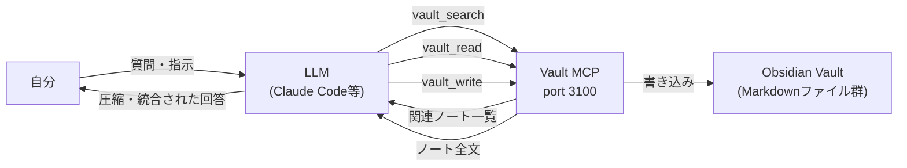

## AI関連の情報、追いきれてる？

LLMの新モデルがリリースされる。MCPの仕様が更新される。
Zennに実装記事が流れる。Xで「これ試した」が回ってくる。
GitHubのスター数が急に伸びているリポジトリがある。

全部追おうとすると本業が止まる。
絞ると、後で「あの手法どこで読んだっけ？」になる。

一番消耗するのが**同じことを毎回調べ直すこと**だった。
「LLMのコンテキスト管理のベストプラクティスって今どうなってる？」を、
先月も今月も調べている。

---

## 問題の本質

情報量が多いことは解決できない。今後も増え続ける。

問題は「**必要な時に必要な情報が出てこない**」ことだった。

完璧に整理しなくていい。
AIに処理させて、自分には圧縮されたエッセンスだけが届く状態を作ればいい。

そのために必要なのは「AIが自分の知識にアクセスできる仕組み」だった。

---

## 作ったもの：Vault MCP サーバー

Obsidian のノートを、AIが読み書きできる HTTP エンドポイントとして公開する
Node.js サーバーを作った。

```
http://127.0.0.1:3100/mcp
```

提供するツールは3つだけ。

| ツール | 役割 |
|-------|------|
| `vault_search(query)` | インデックスから関連ノートを探す |
| `vault_read(path)` | ノートの全文を読む |
| `vault_write(path, content)` | ノートを書き込む |

MCP（Model Context Protocol）に対応しているので、
Claude Code / Gemini CLI など、対応クライアントならどれからでも使える。

---

## 仕組みの全体像



自分がやることは「質問する」だけ。
調査・検索・統合・保存はAIが担う。

---

## Before / After

### Before

「LLMのコンテキスト管理のベストプラクティスって今どうなってる？」

→ Zennで検索、Xで検索、arxivも漁る
→ 5〜10本の記事を斜め読みする
→ どこかにメモする（かしない）
→ 3週間後また同じことを調べている

所要時間: 1〜2時間。残るもの: あいまいな記憶。

### After

「LLMのコンテキスト管理のベストプラクティスを調べて」と打つ。

→ まず Vault 内の既存ノートを検索（過去に調べた内容があれば即参照）
→ なければ外部調査して Vault に保存
→ 次回からは「前回調べた続き」から始められる

所要時間: 20〜30分。残るもの: 次回から参照できる構造化ノート。

**積み上がる**のが違う。毎回ゼロじゃなくなる。

---

## セットアップ（5分）

```bash
git clone https://github.com/EN3Project/knowledge-nexus
cd knowledge-nexus/99_System/mcp
npm install
node nexus-vault.js
```

Claude Code に登録する場合は `.mcp.json` を追加する。

```json
{
  "mcpServers": {
    "nexus-vault": {
      "url": "http://127.0.0.1:3100/mcp"
    }
  }
}
```

Vault のパスは環境変数で変更できる。

```bash
NEXUS_VAULT_PATH=/your/vault/index \
NEXUS_INDEX_PATH=/your/vault/99_System/VaultIndex.md \
node nexus-vault.js
```

---

## 実装のポイント

**ファイルシステム直読み**

データベースもベクトルストアも使っていない。
Markdown ファイルを `fs` で直接読む。
シンプルで、Obsidian の同期（iCloud / Dropbox）とそのまま共存できる。

**VaultIndex.md による検索**

全文検索ではなく、事前に作成したインデックスファイルを使う。
各ノートのパス・タグ・要約が1ファイルに集約されており、
`vault_search` はここを検索してから `vault_read` で必要なノートだけを読む。
トークン消費を抑えつつ、関連ノートを素早く特定できる。

**HTTP 一本化**

SSE（Server-Sent Events）形式の HTTP エンドポイント。
Claude / Gemini など MCP に対応していれば同じ URL で接続できる。
LLM を切り替えても Vault へのアクセス方法は変わらない。

---

## 使ってみて変わったこと

- 「同じ技術情報を2回調べる」がほぼなくなった
- 調査結果が自動的にノートになるので、翌週も参照できる
- 複数の LLM を使い分けても、同じ知識ベースを参照できる

「情報を整理する」コストがゼロになったわけじゃない。
ただ、**整理をAIが担う**ことで、自分の役割が「情報を集める」から「判断する」に変わった。
AI技術の情報収集に使っている時間の多くが、そのまま知識の蓄積になっている。

---

## リポジトリ

https://github.com/EN3Project/knowledge-nexus

MIT + Commons Clause ライセンス。商用販売は不可だが、個人・業務利用は自由。Obsidian と MCP クライアントがあれば動く。
