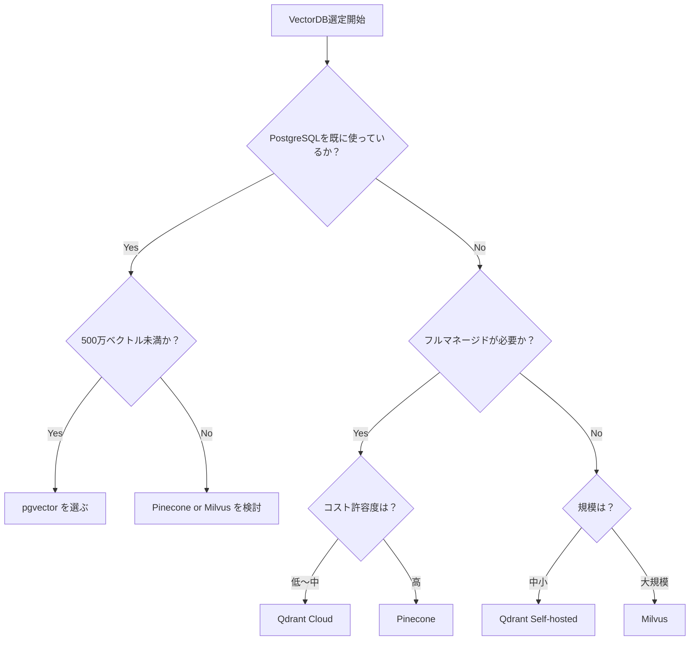
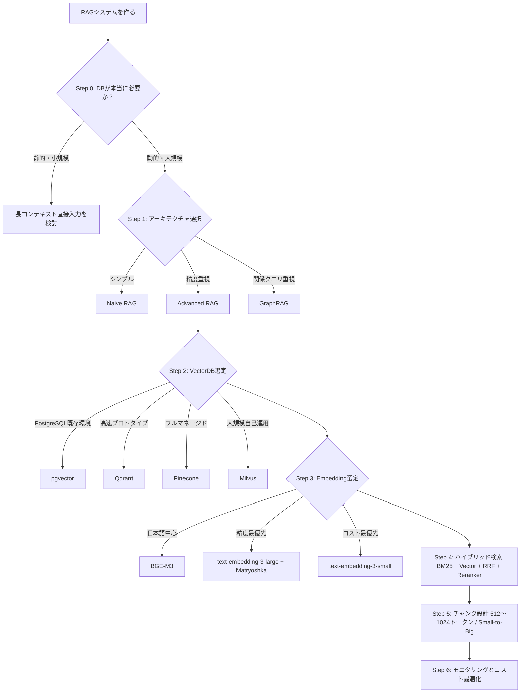

## はじめに — 「DBどれ選べばいい問題」の本質

RAGを実装しようとしたとき、最初にぶつかる壁がある。「ベクトルDBは何を使えばいいのか」という問いだ。

Pinecone、Qdrant、pgvector、Milvus——検索するたびに異なる製品が推薦され、どれも「最高」と書いてある。比較記事は多いが、「自分のユースケースにはどれが正解か」がわからない。

この記事は製品カタログではない。**判断軸と落とし穴**に焦点を当てた設計ガイドだ。

構成は意思決定フロー順になっている。

1. そもそもDBが必要か？（Step 0）
2. RAGアーキテクチャの決定（Step 1）
3. VectorDB選定（Step 2）
4. Embeddingモデル選定（Step 3）
5. 検索戦略設計（Step 4）
6. チャンク設計（Step 5）
7. 本番運用の最適化（Step 6）

Step 0をスキップしてStep 2から読み始めた人が、設計ミスを起こしやすい。順番に読むことをすすめる。

---

## Step 0 — そもそもVectorDBは必要か？

### 「DBが不要なケース」という発想

Andrej Karpathyが指摘したパターンがある。「知識をLLMのコンテキストウィンドウに直接入れてしまえばいい」というものだ。

2024年以降、長コンテキストモデルが実用域に入った。Gemini 1.5 Proは1Mトークン、Claude 3.5 Sonnetは200Kトークンのコンテキストを扱える（2025年時点。最新仕様は各社公式ドキュメントで確認のこと）。小規模な社内FAQ（200〜300ページ程度）なら、RAGを組まずにドキュメント全文をコンテキストに詰め込む方が、実装コストと検索精度の両面で優れる場合がある。

### 判断軸

| 条件 | 推奨アプローチ |
|---|---|
| データが静的、1,000ページ未満 | 長コンテキスト直接入力を検討 |
| データが動的・リアルタイム更新 | RAG + VectorDB が必要 |
| 数百万件以上のドキュメント | RAG + VectorDB 一択 |
| コスト制約が厳しい | まず長コンテキストで検証してからRAGへ |

**落とし穴**: 「RAGを作る」が目的化すると、Step 0の検討が飛ぶ。DBを使わずに解決できる問題にVectorDBを導入すると、不必要な複雑性を抱え込むことになる。

---

## Step 1 — RAGアーキテクチャを決める

### Naive RAG vs Advanced RAG

**Naive RAG**は基本形だ。

```
ユーザークエリ → Embed → VectorDB検索 → Top-K取得 → LLMに渡す
```

実装は簡単だが、精度の上限が低い。クエリがあいまいな場合、関係ないチャンクを取得してしまう「ゴミイン、ゴミアウト」問題が起きやすい。

**Advanced RAG**はクエリの変換と結果の再ランク付けを加える。

```
ユーザークエリ
  → クエリ拡張・分解（HyDE: 仮説文書埋め込み、Multi-Query）
  → ハイブリッド検索（BM25 + ベクトル）
  → Reranker で再ランク付け
  → 上位チャンクをLLMに渡す
```

HyDE（Hypothetical Document Embeddings）は「クエリに対する仮説的な回答文」を先に生成し、その埋め込みで検索する手法だ。クエリが短く意味的に薄い場合に効果的。

### GraphRAG（第三の選択肢）

Microsoftが開発したGraphRAGは、ドキュメント間の関係をグラフ構造で保持する。「AとBとCの共通点は？」「この人物に関連するイベントを時系列で」といった複雑な関係クエリに強い。

Neo4jのメモリプロバイダー統合が進んでおり、Agentシステムとの相性がいい。ただし実装難度は高く、単純な類似検索にはオーバースペックだ。

### 判断軸

- **プロトタイプ段階** → Naive RAGで始める。動くものを作ってから精度改善に着手する
- **本番精度が必要** → Advanced RAGへ移行。クエリ変換とRerankerを追加する
- **複雑な関係クエリが必要** → GraphRAGを検討。ただし導入コストを事前に試算する

---

## Step 2 — VectorDB選定

### 4製品の比較マトリクス

| DB | 月額コスト目安 | 最適規模 | 運用負担 | 特徴 |
|---|---|---|---|---|
| pgvector | $50〜100 | 500万ベクトル未満 | 低（PostgreSQL既存環境なら） | 既存DBに統合、SQL使える |
| Qdrant | $25〜200（クラウド） | 中規模まで | 低〜中 | 低レイテンシ設計、Docker 1コマンド起動 |
| Pinecone | $300〜1,000 | 中〜大規模 | 極低（フルマネージド） | スケールアウト自動、SLA保証 |
| Milvus | $1,000〜5,000 | エンタープライズ | 高 | 大規模自己運用、高いカスタマイズ性 |

> 料金は2025年末時点の目安。各社の公式料金ページで最新値を確認すること。pgvectorはRDS・Neon等のマネージドサービスを想定。

### 意思決定フロー



### 最重要の落とし穴：「無料OSSのTCO問題」

QdrantやMilvusは「無料OSS」として紹介されることが多い。しかし本番運用のコストを試算すると話が変わる。

自己ホスティングのコストには以下が含まれる。

- インフラコスト（EC2、GCE等）
- モニタリング・アラート設定工数
- バージョンアップ・障害対応の人件費
- バックアップ・DR設計の工数

スタートアップが「Pinecone高いからQdrant自前運用にした」と判断した後、エンジニアが月に10〜20時間を運用に費やすケースは珍しくない。時給換算すると、Pineconeのコストを超えることがある。

**判断の原則**: チームにインフラ専任がいない場合、マネージドサービスのコストは保険料として計上する。

---

## Step 3 — Embeddingモデル選定

### 3モデルの実践比較

| モデル | 次元数 | コスト | 日本語対応 | 推奨シーン |
|---|---|---|---|---|
| text-embedding-3-small | 1,536 | $0.02/1Mトークン | 可（英語比で劣る） | コスト重視、英語中心 |
| text-embedding-3-large | 3,072 | $0.13/1Mトークン | 良好 | 精度最優先 |
| BGE-M3 | 1,536 | OSS（自己ホスト） | 優秀（多言語特化） | 日本語コンテンツ、Dense+Sparse+ColBERT 3in1 |

### Matryoshka次元削減という選択肢

text-embedding-3-largeはMatryoshka Representation Learning（MRL）に対応している。3,072次元のベクトルを256次元に削減しても品質損失が最小に抑えられる。

コスト面での影響は大きい。

- ストレージコスト：約12分の1に削減
- 検索レイテンシ：大幅に改善
- 品質：実用域ではほぼ損失なし

精度と費用のバランスが最も取りやすい選択肢になっている。

### 日本語エンジニアへの推奨

日本語コンテンツを主に扱う場合、**BGE-M3が最有力候補**だ。

理由は三つある。第一に、多言語モデルとして設計されており日本語の品質が高い。第二に、Dense（ベクトル）、Sparse（BM25相当）、ColBERT（遅延インタラクション）の3種類の検索表現を一つのモデルで生成できる。第三に、コストがtext-embedding-3-smallと同等水準だ（自己ホストの場合）。

---

## Step 4 — 検索戦略設計

### 2026年の標準：ハイブリッド検索

「ベクトル検索だけ使う」は2024年以前の設計だ。2026年現在、精度が求められるシステムではBM25（キーワード検索）とベクトル検索の組み合わせが標準になっている。

理由はシンプルだ。ベクトル検索は意味的類似性に強いが、固有名詞・型番・コードのような完全一致が重要なクエリに弱い。BM25はその逆だ。組み合わせることで互いの弱点を補完する。

### RRFによる統合の実装例

```python
from qdrant_client import QdrantClient
from qdrant_client.models import SparseVector, NamedSparseVector

def hybrid_search(client: QdrantClient, collection_name: str,
                  dense_vector: list[float], sparse_vector: dict,
                  limit: int = 10):
    """
    RRF (Reciprocal Rank Fusion) を用いたハイブリッド検索。
    dense_vector: Embeddingモデルで生成した密ベクトル
    sparse_vector: BM25等で生成したスパースベクトル {"indices": [...], "values": [...]}
    """
    results = client.query_points(
        collection_name=collection_name,
        prefetch=[
            {"query": dense_vector, "using": "dense", "limit": 20},
            {"query": NamedSparseVector(
                name="sparse",
                vector=SparseVector(**sparse_vector)
            ), "limit": 20},
        ],
        query={"fusion": "rrf"},
        limit=limit,
    )
    return results.points


def reciprocal_rank_fusion(dense_results: list, sparse_results: list,
                           k: int = 60) -> list:
    """
    手動RRF実装（ライブラリ非依存版）。
    k=60 はランクの影響を平滑化するための標準値。
    """
    scores = {}
    for rank, result in enumerate(dense_results):
        doc_id = result.id
        scores[doc_id] = scores.get(doc_id, 0) + 1 / (k + rank + 1)
    for rank, result in enumerate(sparse_results):
        doc_id = result.id
        scores[doc_id] = scores.get(doc_id, 0) + 1 / (k + rank + 1)
    return sorted(scores.items(), key=lambda x: x[1], reverse=True)
```

### Rerankerの追加

ハイブリッド検索の後段にRerankerを挟むと、さらに精度が上がる。クロスエンコーダーはクエリとチャンクを同時に評価するため、独立スコアの集計よりも関連性判断が精密だ。

```python
from sentence_transformers import CrossEncoder

reranker = CrossEncoder("cross-encoder/ms-marco-MiniLM-L-6-v2")

def rerank(query: str, chunks: list[str], top_n: int = 5) -> list[str]:
    pairs = [(query, chunk) for chunk in chunks]
    scores = reranker.predict(pairs)
    ranked = sorted(zip(chunks, scores), key=lambda x: x[1], reverse=True)
    return [chunk for chunk, _ in ranked[:top_n]]
```

Cohere Rerank APIを使う場合は、自己ホストが不要でAPIキー1本で済む。小規模なら月額コストも低い。

### 落とし穴：ハイブリッドは万能ではない

ハイブリッド検索を導入すると、**重みチューニングが必須**になる。Dense側とSparse側のスコアをどの比率で合成するかによって、精度が大きく変わる。

チューニングには評価データセットが必要だ。「クエリ → 正解ドキュメント」のペアを最低50〜100件準備し、MRR（Mean Reciprocal Rank）やNDCGで計測しながら調整する。

評価データセットを用意せずにハイブリッド検索を導入しても、精度が上がったか下がったか判断できない。

---

## Step 5 — チャンク設計

### 推奨パラメータとその根拠

| パラメータ | 推奨値 | 根拠 |
|---|---|---|
| チャンクサイズ | 512〜1,024トークン | 意味の完結性と検索精度のバランス |
| オーバーラップ | 10〜25%（51〜256トークン） | 文脈の断絶を防ぐ |
| 最大サイズ | 2,048トークン（上限目安） | これ以上は関連度スコアの希薄化が起きやすい |

一般的な傾向として、4,000トークンを超える大きなチャンクは検索精度の低下が報告されている。チャンク内の情報密度が下がり、クエリとの関連度スコアが希薄化されるためだ。ただしモデルや検索アルゴリズムによって挙動は異なるため、実際のデータで計測することが重要。

### 「大きいチャンクの方が文脈が保たれる」は正しいが、裏目に出る

直感は正しい。文脈が保たれていれば、LLMへの回答品質は上がる。問題は**検索フェーズ**にある。大きなチャンクは取得精度が下がる。

解決策が**Small-to-Big Retrieval**だ。

```
検索: 小さいチャンク（256〜512トークン）で高精度に取得
↓
展開: 取得後に前後の親チャンクを付加してLLMに渡す
```

LangChainでは `ParentDocumentRetriever`、LlamaIndexでは `NodeWithScore` + `parent_node` 参照で実装できる。検索精度と文脈品質の両立に有効な手法だ。

### 実装上の注意

- 文境界・段落境界でチャンクを区切る（トークン数で機械的に区切ると文中断が起きる）
- タイトル・見出し情報をメタデータとして保持する（フィルタリングに活用）
- 同一ドキュメントのチャンクに `doc_id` を付与し、後から参照元を特定できるようにする

---

## Step 6 — 本番運用の最適化

### 検索品質のモニタリング

RAGシステムは「一度作ったら終わり」ではない。コンテンツが更新され、ユーザーのクエリパターンが変化するにつれて、精度は劣化する。

最低限モニタリングすべき指標を以下に示す。

- **MRR（Mean Reciprocal Rank）**: 正解ドキュメントが何番目に来るかの平均逆数
- **ユーザーフィードバック**: 「役に立った / 役に立たなかった」のシンプルなフラグ
- **検索ヒット率**: Top-Kに正解が含まれる割合

フィードバックループを設計しておくと、精度改善のサイクルが回しやすくなる。

### コスト最適化の実践

- **Matryoshka削減の適用**: 3,072次元で生成し、保存は256〜512次元に削減する
- **キャッシュ戦略**: 同一クエリの検索結果をRedisなどでキャッシュする（TTLは更新頻度に合わせる）
- **バッチEmbedding生成**: ドキュメント追加時はAPIを個別に叩かず、バッチ処理でコストを削減する

### 最新トレンドへの目配り

現時点（2026年）で注目すべき方向性は三つある。

**Multimodal RAG**は画像とテキストを統合した検索を可能にする。製品マニュアルや医療画像などのドメインで需要が高まっている。

**Agent向けDB統合**はLLMエージェントが自律的にDBを読み書きする設計だ。Neo4jのメモリプロバイダーとLangGraph等の組み合わせが実用段階に入っている。

**GraphRAG**は複雑なエンタープライズ向けクエリでの採用事例が増えている。ただし、一般的なQAシステムへの導入は引き続き慎重な判断が必要だ。

---

## まとめ — 意思決定フローの全体像



### 「迷ったらこれ」のスターターセット

はじめてRAGを本番に持っていく場合、以下の組み合わせが最もリスクが低い。

- **VectorDB**: Qdrant（Docker Self-hosted → 必要に応じてCloudへ移行）
- **Embedding**: BGE-M3（日本語が主な場合）
- **検索戦略**: ハイブリッド検索（BM25 + Dense + RRF）
- **チャンクサイズ**: 768トークン、15%オーバーラップ
- **評価**: 50件の評価データセットを先に作る

設計は「動かしてから改善する」が基本だ。完璧な設計を求めて着手が遅れるより、Naive RAGで動かして評価データを集め、そこから判断する方が最終的に速い。

---

## 裏付け資料

- [2026年版ベクトルDB選定ガイド](https://zenn.dev/0h_n0/articles/8c8bb192985b64)
- [ハイブリッド検索BM25×RRFガイド 2026年版](https://renue.co.jp/posts/hybrid-search-bm25-vector-rrf-rag-guide-2026)
- [RAG教科書 2025年5月完全版](https://zenn.dev/microsoft/articles/rag_textbook)
- [Google Cloud - pgvector インデックス最適化](https://cloud.google.com/blog/ja/products/databases/faster-similarity-search-performance-with-pgvector-indexes?hl=ja)
- [GraphRAG・Neo4j・Knowledge Graph 実装ガイド 2026年版](https://renue.co.jp/posts/graphrag-microsoft-neo4j-knowledge-graph-rag-implementation-2026)
- [Embedding モデル比較 2026](https://knightli.com/en/2026/04/23/compare-openai-bge-e5-gte-jina-embedding-models/)
- [Qdrant 公式ベンチマーク](https://qdrant.tech/benchmarks/)

---

*この記事は2026年5月時点の情報に基づいています。VectorDB各製品の価格・性能は変動します。公式ドキュメントで最新情報を確認してください。*
