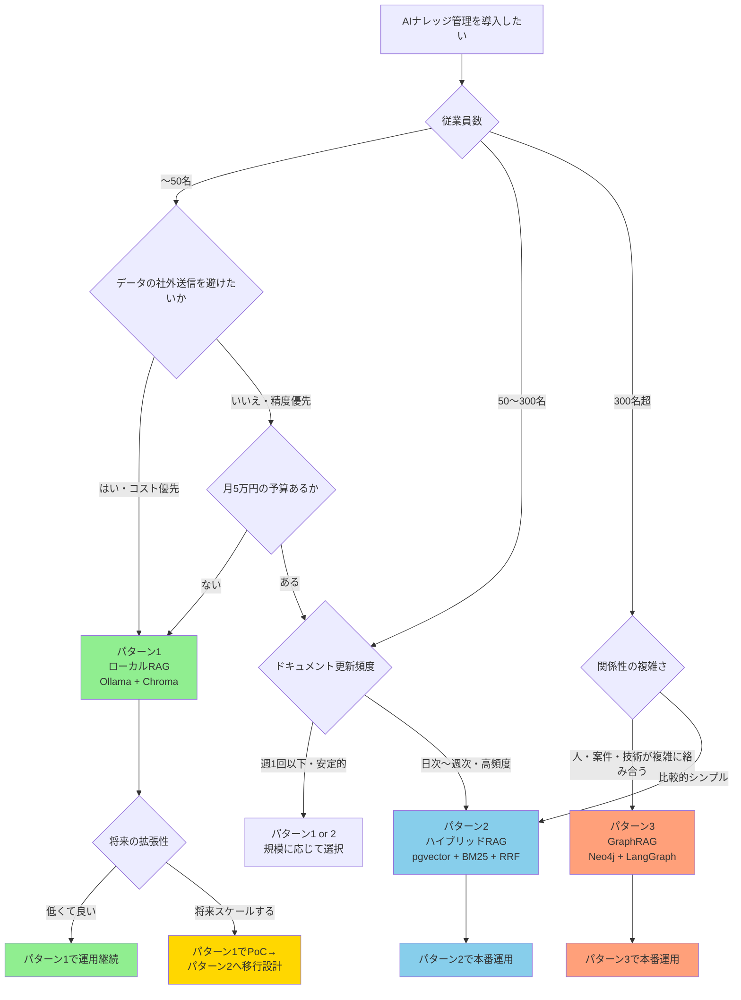

:::message
対象読者: 中小企業で AI ナレッジ管理の導入を検討している IT 担当・エンジニア・経営者
前提知識: RAG という言葉を聞いたことがある程度
確認日: 2026-05-29
読了時間: 約12分
:::

## 整理するきっかけ

社内文書を AI に読ませれば、問い合わせ対応やナレッジ検索が楽になる。そう考えて RAG の検討を始めると、まず直面するのが「どのベクトルDBを選ぶか」という問いだ。

ただ、規模別に整理してみると、意外と選択肢が分かれた。小さい会社でクラウド型の重い構成を入れる必要がないケースもあれば、逆に単純なベクトル検索だけでは答えにくい質問が多い会社もある。

ある調査では、中小企業の AI 導入率は大企業より低い傾向にある。その差は、ツールの有無だけでなく、「導入後も知識を保守し続ける設計まで考えているか」にあるように感じた。

## 前提条件を整理してみた

AI ナレッジ管理の設計を比べてみると、失敗パターンの多くは検索方式の選定ミスとして見える。ただその背景には、前提条件を測らずにアーキテクチャを選んでいることが多いように思う。

たとえば 50名未満でローカル完結の社内 FAQ が目的なら、大きなクラウド構成は過剰になりやすい。一方、製品仕様・営業資料・問い合わせ履歴が日次で更新される環境では、小さな RAG だけでは運用が詰まってくる。

さらに、人員・案件・顧客・技術スタックの関係を横断して質問したい場合は、文書の近さだけでは答えにくくなる。「A社の案件で、React経験があり、過去に似た障害対応をした人は誰か」という質問は、チャンク検索より関係性検索の問題に近い。

整理してみると、アーキテクチャ選択の本質は「どれが最強か」を決めることではなく、**最小のコストで十分な精度が出る前提条件を計測すること**だと感じた。

## 3つに共通していた設計の考え方

パターンを比べてみると、3つすべてに共通していたのが「取り込み時に知識をコンパイルしておく」という考え方だった。

英語では Progressive Disclosure と呼ばれる。日本語では「必要な情報を、必要な粒度で、段階的に渡す設計」と考えるとわかりやすいかもしれない。

避けたほうが良さそうなのは、クエリ時に毎回生ドキュメントを解釈させる構成だ。人間向け文書には「前述の通り」「この仕様」などの文脈依存表現が多い。そのままチャンク化すると、検索で引けても単独では意味が通じないことがある。

3パターンでは、コンパイルの形が変わってくる。

| パターン | コンパイルの形 |
|---|---|
| ローカルRAG | Chroma へのベクトル化 |
| ハイブリッドRAG | pgvector + BM25 の検索インデックス化 |
| GraphRAG | Neo4j 上のノード・エッジ構造化 |

ツール名より先に、この事前加工を自社で保守できるかを考えると判断しやすくなりそうだ。

## パターンはこう分かれた

判断軸は、従業員数・データの社外送信可否・更新頻度・関係性の複雑さの4つになりそうだった。まずは次のフローで当たりを付けてみると良いかもしれない。

## 3つのパターンを整理してみた

### パターン1：ライトウェイト・ローカルRAG

小規模で、データの社外送信を避けたい会社に向きそうなのがこのパターンだ。構成は Ollama、Mistral 7B または Phi 3.5、Chroma、LangChain が中心になる。

完全ローカルで動かせるため、API 費用を抑えやすい。社内 FAQ、手順書、マニュアル検索のような用途から試しやすい。

一方で、スケールと検索品質には上限がある。ベクトル検索単体では、固有名詞・型番・短いエラーコードの検索が苦手になりやすい傾向があった。ドキュメント更新が増えてきたら、早めに移行先を考えておくと良さそうだ。

初期構築コストは数十〜数百万円（構成・工数による）で見ておくのが現実的だと思う。OSS ライセンスだけを見て「ほぼ無料」と考えると、設計・整理・評価・運用の工数を見落としやすい。

### パターン2：ハイブリッド検索RAG

50〜300名規模で、製品ドキュメントや営業ナレッジを扱うならハイブリッド検索が候補になりそうだ。構成は OpenAI または Claude、pgvector、BM25、RRF、LlamaIndex などが中心だ。

ベクトル検索は意味の近さに強く、BM25 はキーワード一致に強い。RRF（Reciprocal Rank Fusion）はそれぞれの検索結果順位を統合する手法だ。意味検索とキーワード検索の弱点を補い合える点が面白かった。

精度改善幅として 15〜25% 程度が語られることがあるが、これは特定の評価設定における改善幅なので、自社文書で同じ数字が出るかどうかは別で測る必要がある。

月額コストの目安は ¥3〜5万ほどだが、これは API 費用のみだ。インフラ・保守・開発工数は別途かかってくる。

### パターン3：GraphRAG

300名超の組織や、部署・案件・顧客・人員・技術スタックの関係性が複雑な場合に候補になりそうなのがこのパターンだ。構成は Neo4j、LangGraph、GPT-4.5 または Claude Opus などになる。

GraphRAG は文書をチャンク集合として扱うだけでなく、ノードとエッジで関係性を表現する。質問が「近い文章を探す」だけでなく「関係をたどる」処理になるのが特徴的だった。

ただ、最初から選ぶには重い。グラフDB設計・データモデリング・権限設計・評価設計が必要になってくる。初期構築は ¥1,000万〜、月額も ¥50〜300万規模を見込む構成になりやすい。

特定ベンチマークでは通常のベクトル RAG より高い精度が報告されることがあるが、これは Microsoft Research の研究における特定ベンチマーク条件下での結果であり、一般的な業務文書への直接外挿はできない点は注意が必要だ。

### 3パターンの比較

| 観点 | パターン1: ローカルRAG | パターン2: ハイブリッドRAG | パターン3: GraphRAG |
|---|---|---|---|
| **対象規模** | 5〜50名 | 50〜300名 | 300名超 |
| **月額コスト** | ほぼ¥0（OSSライセンス） | ¥3〜5万（API費用のみ） | ¥50〜300万 |
| **初期構築コスト** | 数十〜数百万円（構成・工数による） | ¥200〜500万 | ¥1,000万〜 |
| **技術難易度** | 中（Dockerが使えれば可） | 高（pgvector + BM25 + RRFの統合） | 最高（グラフDB設計 + LangGraph） |
| **検索精度** | 中程度（ベクトル単体） | 高（ハイブリッド検索） | 最高（複雑な関係性クエリに強い） |
| **向いているユースケース** | 社内FAQ・マニュアル検索 | 製品ドキュメント・営業ナレッジ | 人員・プロジェクト・技術の複雑な関係性検索 |
| **外部依存** | なし（完全ローカル） | OpenAI/Claude API | OpenAI/Claude API + Neo4j |
| **主要コンポーネント** | Ollama + Mistral 7B + Chroma + LangChain | OpenAI/Claude + pgvector + BM25 + RRF + LlamaIndex | Neo4j + LangGraph + GPT-4.5/Claude Opus |

## やりがちな失敗パターン

### ベクトルDBを入れれば解決、と思いがち

ベクトルDBは検索基盤であって、知識整理の代替ではない。古い情報・重複・矛盾を含む文書をそのまま入れると、LLM はそれらを材料に回答してしまう。

まずやっておきたいのは、チャンク単独で意味が通じる状態にすることだ。「何の、どのシステムの、いつ時点の情報か」をチャンク内に持たせておくと検索精度が安定しやすかった。

### ドキュメントを全部入れたくなる

文書量が多いほど精度が上がるわけではなかった。古い仕様・重複した議事録・途中で破棄された設計案はノイズになりやすい。

AI ナレッジ管理では、入れる作業より削る作業のほうが効く場面が多い印象だ。検索対象を増やす前に、最新版・正式版・参照すべき版を決めておくと良さそうだ。

### 評価せずに体感で判断してしまう

「前より良くなった気がする」は評価ではない。最初に 30〜50 問のゴールデンセットを作り、期待回答または期待ソースを決めておくと後で比較しやすくなる。

RAGAS や DeepEval のような評価フレームワークを使うと、faithfulness や context precision を測れる。少なくとも PoC の段階で baseline を取っておくと、改善の根拠を説明しやすくなった。

### 一度作って終わりにしてしまう

社内文書は変わり続ける。製品仕様・営業資料・運用ルール・問い合わせ履歴は更新され続けるため、インデックス・チャンク・グラフ・評価セットも合わせて更新する設計にしておく必要がある。月次または四半期で lint と再評価を回す仕組みを最初から考えておくと、運用が楽になりそうだった。

## 段階的に進めるとこんな道筋になりそう

最初から GraphRAG を目指すより、段階的に育てるほうが失敗しにくいと感じた。

### PoC（1〜4週）

まずパターン1で検証してみる。対象文書を絞り、30〜50 問の評価セットを作り、社内で「これは使える」と言える質問領域を確認する。この段階では全社展開を狙わず、問い合わせ削減・マニュアル検索・オンボーディング補助など、1つの業務に絞ると進めやすい。

### 本番（2〜3ヶ月）

利用者と文書更新が増えてきたら、パターン2への移行を検討する。pgvector と BM25 を併用し、RRF で統合する構成だ。ここで必要になってくるのは、権限・ログ・評価・運用担当の明確化だ。API 費用だけでなく、保守工数も予算化しておくと後で困りにくい。

### 高度化（18ヶ月+）

関係性検索が経営判断や人員配置に効いてくる段階になってから、GraphRAG を検討するのが現実的だと思う。最初の問いは「グラフでなければ答えられない質問があるか」だ。案件・人員・技術・顧客・市場の関係をたどる必要があるなら、グラフ化の投資に意味が出てくる。単なる文書検索ならパターン2で十分な場合が多そうだった。

## まとめ：実装前に確認してみると良さそうな5項目

AI ナレッジ管理の設計では、次の5項目を事前に確認しておくと判断がしやすくなった。

- ドキュメント量と更新頻度を測ったか
- データの社外送信可否を決めたか
- 30〜50 問のゴールデンセットを作ったか
- 月額費用だけでなく構築・保守工数を見積もったか
- 1年後にパターンを移行できる設計にしたか

RAG は強い選択肢のひとつだが、常に正解になるわけではない。中小企業にとって大事なのは、最初から最強構成を目指すことよりも、今の規模で運用できる最小構成から始めることだと考えている。

## 参考文献・ソース

- https://zenn.dev/nttdata_tech/articles/2b80f968856c36
- https://ai-market.jp/technology/hybrid-search/
- https://zenn.dev/msmtec/articles/90d95080100ab8
- https://saiteki-ai.com/development/ai-model/rag-building-method/
- https://renue.co.jp/posts/vector-database-rag
- https://renue.co.jp/posts/graph-database-knowledge-graph-neo4j-graphrag-ai-guide
- https://www.systemdesignhandbook.com/guides/graphrag-vs-vector-rag/
- https://www.creationline.com/tech-blog/tech-blog/data-management/neo4j/45512
- https://pionero.io/ja/blog-detail/vector-database-comparison-2025/
- https://renue.co.jp/posts/llamaindex-complete-guide-rag-langchain-2026
- https://tasukehub.com/articles/vector-database-comparison-2025
- https://www.aquallc.jp/rag-guide-sme/
- https://www.openbridge.jp/column/local-llm-company-2025
- https://aws.amazon.com/bedrock/pricing/
- https://zenn.dev/hisamitsu/articles/6d791e2c57c5a2
